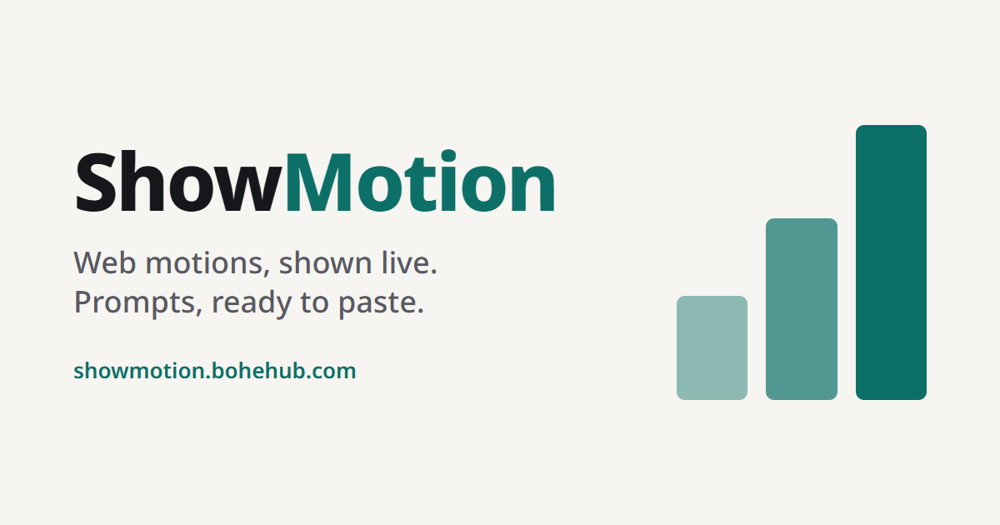

# ShowMotion

See web motion in action, learn its name, and copy a prompt for your AI coding agent.

**Live site:** https://showmotion.bohehub.com



## Why

Most people recognize a web animation when they see it but don't know what it's called, which makes it hard to ask an AI coding agent for it. ShowMotion plays each motion live, gives it a name (plus the other names it goes by), and hands you a short prompt you can paste into Claude Code, Cursor, Codex, or any other agent.

## Features

- **259 motions** in 15 categories — entrance & exit, scroll, text, hover, cursor, page transitions, loading, 3D, and more
- **Live demos** — every card plays the real motion; hover, click, drag, or scroll demos tell you how to trigger them
- **Copy-ready prompts** — replace the `[where]` placeholder with your target and paste
- **9 languages** — English, Español, Deutsch, Français, Português (Brasil), 日本語, 한국어, 简体中文, 繁體中文
- **Search** by name, alias, or what the motion does, including CJK word matching
- **Machine-readable** — [`/motions.json`](https://showmotion.bohehub.com/motions.json) and [`/llms.txt`](https://showmotion.bohehub.com/llms.txt)
- Respects `prefers-reduced-motion`

## Tech stack

- [Astro](https://astro.build/) 7 — fully static output, no client framework
- TypeScript
- [Lucide](https://lucide.dev/) icons
- Hosted on Cloudflare Pages

## Getting started

Requires Node.js 22.12 or later.

```sh
npm install
npm run dev
```

Then open http://localhost:4321.

| Command | What it does |
|---|---|
| `npm run dev` | Start the dev server |
| `npm run build` | Build the static site into `dist/` |
| `npm run preview` | Serve the built site locally |
| `npm run check` | Type-check, including that every motion has all 9 languages |
| `npm run i18n:missing` | List untranslated motion text |

## Project structure

```text
src/
├── components/demos/   # One demo component per motion
├── data/motions/       # Motion catalog, one file per category
├── i18n/               # Locales and UI strings for all 9 languages
├── pages/              # Routes, sitemap, search index, motions.json, llms.txt
├── scripts/            # Client-side playback and search
└── styles/
public/                 # Favicons, OG image, robots.txt
scripts/                # Build helpers (per-page demo CSS, icons, translation check)
```

## Adding a motion

1. Add an entry to the matching file in `src/data/motions/` with its description, use cases, and prompt.
2. Add its demo component to `src/components/demos/`.
3. Fill in all 9 languages — `npm run check` fails otherwise.
4. Run `npm run build` to confirm the demo and id resolve.

## License

[MIT](LICENSE)
